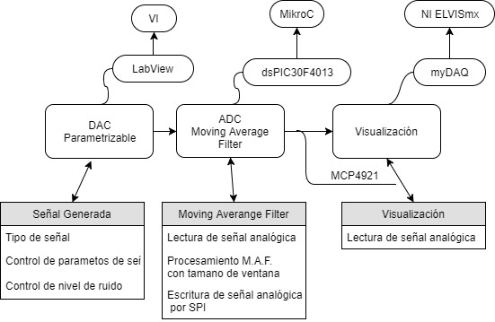

# Moving_average_filter
Realtime_MVF_LabView_dsPIC30F4023



### Algoritmo Implementado
Moving Averange Filter formula clásica
<pre>
<a href="https://www.codecogs.com/eqnedit.php?latex=y[i]=\frac{1}{M}\sum_{j=0}^{M-1}x[i&plus;j]" target="_blank"></a>
</pre>
En donde 
* <a href="https://www.codecogs.com/eqnedit.php?latex=y[i]=\frac{1}{M}\sum_{j=0}^{M-1}x[i&plus;j]" target="_blank"></a> es la señal filtrada.
* <a href="https://www.codecogs.com/eqnedit.php?latex=y[i]=\frac{1}{M}\sum_{j=0}^{M-1}x[i&plus;j]" target="_blank"></a> es el tamaño de la ventana.
* <a href="https://www.codecogs.com/eqnedit.php?latex=y[i]=\frac{1}{M}\sum_{j=0}^{M-1}x[i&plus;j]" target="_blank"></a> señal de ingreso.

Cuyo espectro en frecuencia por el filtro es 
<pre>
<a href="https://www.codecogs.com/eqnedit.php?latex=H=\frac{\sin(\pi*f*M)}{M*\sin(\pi*f)}" target="_blank"></a>
</pre>
Para el caso de tiempo real se propone la siguiente expresión.
<pre>
<a href="https://www.codecogs.com/eqnedit.php?latex=y_{RT}[i]=\frac{1}{M}\sum_{j=0}^{M-1}x_{RT}[j]" target="_blank"></a>
</pre>
En donde
* <a href="https://www.codecogs.com/eqnedit.php?latex=y_{RT}[i]" target="_blank"></a> muestra de la señal filtrada.
* <a href="https://www.codecogs.com/eqnedit.php?latex=M" target="_blank"></a> es el tamaño de la ventana.
* <a href="https://www.codecogs.com/eqnedit.php?latex=x_{RT}[k]" target="_blank"></a> muestra tomada de la señal de ingreso.

Nota: las muestras de la ventana <a href="https://www.codecogs.com/eqnedit.php?latex=x[0],x[1],...,x[M-1]" target="_blank"></a> , no se realiza el proceso de filtrado en un tiempo $$t=0$$, esto por formación inicial de la ventana.

A partir de lo planteado anteriormente de obtiene 
<pre>
<a href="https://www.codecogs.com/eqnedit.php?latex=y_{RT}[i]=\frac{1}{M}\sum_{j=0}^{M-1}x_{RT}[j]" target="_blank"></a>
</pre>
### Capacidad de procesamiento
Para la implementación se está usando un cristal oscilador externo de $$7.3728MHz$$ con un $$PLLx16$$, es decir es que el microprocesador está funcionando a $$118MHz$$ de ello tenemos:
<pre>
<a href="https://www.codecogs.com/eqnedit.php?latex=MIPS=(\frac{118Mciclosdereloj}{4})=29.5MIPS" target="_blank"></a>
</pre>
### Frecuencia de muestreo:
Para el calculo de la frecuencia de muestreo se procede a hacer el análisis en el código ensamblador únicamente en el bucle infinito como sigue a continuación:
```
||||||||||||||||||||||||||||||||||||||||||||||||||||||||||||||||||||||||
    _DAC_Output:
	BCLR	LATF0_bit, BitPos(LATF0_bit+0)
	LSR	W10, #8, W0
	AND	W0, #15, W0
	ZE	W0, W1
	MOV	#48, W0
	IOR	W1, W0, W0
	PUSH	W10
	ZE	W0, W10
	CALL	_SPI1_Write
	POP	W10
	ZE	W10, W10
	CALL	_SPI1_Write
	BSET	LATF0_bit, BitPos(LATF0_bit+0)
L_end_DAC_Output:
	RETURN

||||||||||||||||||||||||||||||||||||||||||||||||||||||||||||||||||||||||

L_main0:
	MOV	_M, W0
	SUB	W0, #1, W1
	MOV	#lo_addr(_cont), W0
	CP	W1, [W0]
	BRA LE	L__main11
	GOTO	L_main2
L__main11:
	MOV	_M, W0
	DEC	W0
	SL	W0, #1, W1
	MOV	#lo_addr(_datos), W0
	ADD	W0, W1, W0
	MOV	W0, [W14+0]
	MOV	#1, W10
	CALL	_ADC1_Read
	MOV	[W14+0], W1
	MOV	W0, [W1]
	CLR	W0
	MOV	W0, _suma
	CLR	W0
	MOV	W0, _i
L_main3:
	MOV	_M, W0
	SUB	W0, #1, W1
	MOV	#lo_addr(_i), W0
	CP	W1, [W0]
	BRA GE	L__main12
	GOTO	L_main4
L__main12:
	MOV	_i, W0
	SL	W0, #1, W1
	MOV	#lo_addr(_datos), W0
	ADD	W0, W1, W0
	MOV	[W0], W1
	MOV	#lo_addr(_suma), W0
	ADD	W1, [W0], [W0]
	MOV	_i, W0
	CP	W0, #1
	BRA GE	L__main13
	GOTO	L_main6
L__main13:
	MOV	_i, W0
	DEC	W0
	SL	W0, #1, W1
	MOV	#lo_addr(_datos), W0
	ADD	W0, W1, W2
	MOV	_i, W0
	SL	W0, #1, W1
	MOV	#lo_addr(_datos), W0
	ADD	W0, W1, W0
	MOV	[W0], [W2]
L_main6:
	MOV	#1, W1
	MOV	#lo_addr(_i), W0
	ADD	W1, [W0], [W0]
	GOTO	L_main3
L_main4:
	MOV	_suma, W0
	MOV	_M, W2
	REPEAT	#17
	DIV.U	W0, W2
	CLR	W1
	CALL	__Long2Float
	MOV	W0, _prom
	MOV	W1, _prom+2
	GOTO	L_main7
L_main2:
	MOV	_cont, W0
	SL	W0, #1, W1
	MOV	#lo_addr(_datos), W0
	ADD	W0, W1, W0
	MOV	W0, [W14+0]
	MOV	#1, W10
	CALL	_ADC1_Read
	MOV	[W14+0], W1
	MOV	W0, [W1]
	MOV	#1, W1
	MOV	#lo_addr(_cont), W0
	ADD	W1, [W0], [W0]
L_main7:
	MOV	_prom, W0
	MOV	_prom+2, W1
	CALL	__Float2Longint
	MOV	W0, W10
	CALL	_DAC_Output
	GOTO	L_main0
L_end_main:
	POP	W10
	ULNK
L__main_end_loop:
	BRA	L__main_end_loop
; end of _main
``` 

Entonces con los valores referidos al datasheet:

#num Instrucciones BCLR =1 – 1 ciclo
#num Instrucciones LSR=1 – 1 ciclo
#num Instrucciones AND=1 – 1 ciclo
#num Instrucciones ZE=3 – 1 ciclo
#num Instrucciones MOV=40 – 1 ciclo
#num Instrucciones IOR=1 – 1 ciclo
#num Instrucciones PUSH=1 – 1 ciclo
#num Instrucciones CALL=7 – 2 ciclo
#num Instrucciones POP=2 – 1 ciclo
#num Instrucciones BSET=1 – 1 ciclo
#num Instrucciones AND=1 – 1 ciclo
#num Instrucciones RETURN=1 – 3 ciclo
#num Instrucciones SUB=2 – 1 ciclo
#num Instrucciones CP=3 – 1 ciclo
#num Instrucciones BRA LE=1 – 2 ciclo
#num Instrucciones GOTO=6 – 2 ciclo
#num Instrucciones DEC=2 – 1 ciclo
#num Instrucciones SL=5 – 1 ciclo
#num Instrucciones ADD=8 – 1 ciclo
#num Instrucciones CLR=3 – 1 ciclo
#num Instrucciones BRA GE=2– 2 ciclo
#num Instrucciones AND=1 – 1 ciclo
#num Instrucciones REPEAT=1 – 1 ciclo
#num Instrucciones AND=1 – 1 ciclo
#num Instrucciones DIV.U=1 – 18 ciclo
#num Instrucciones ULNK=1 – 1 ciclo
#num Instrucciones BRA=1 – 2 ciclo
<pre>
<a href="https://www.codecogs.com/eqnedit.php?latex=t_{total}=(numerociclostotal)*4" target="_blank"></a>
</pre>
A un promedio de un 2 registro/instrucción
<pre>
<a href="https://www.codecogs.com/eqnedit.php?latex=t_{total}=(234)*(4)*(2)=1872&space;ciclos&space;de&space;maquina&space;(cm)" target="_blank"></a>
</pre>
entonces
<pre>
<a href="https://www.codecogs.com/eqnedit.php?latex=Fs=\frac{118MHz}{1872cm}=63.034&space;ksamples/seg" target="_blank"></a>
</pre>
A un promedio de un 3 registro/instrucción
<pre>
<a href="https://www.codecogs.com/eqnedit.php?latex=t_{total}=(234)*(4)*(3)=2808&space;ciclos&space;de&space;maquina&space;(cm)" target="_blank"></a>
</pre>
entonces
<pre>
<a href="https://www.codecogs.com/eqnedit.php?latex=Fs=\frac{118MHz}{2808cm}=42.023&space;ksamples/seg" target="_blank"></a>
</pre>
